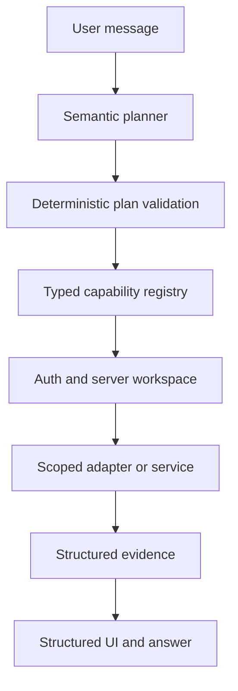

# Assistant architecture

Status: W3 foundation, independent of the pending W1 telecom data model.

## Runtime boundary

The model may propose a capability and arguments. It cannot choose a workspace, create SQL, select arbitrary URLs, grant permissions or manufacture a confirmation.

## Implemented foundation

- `CapabilityRegistry` rejects duplicate, open or internally inconsistent contracts.
- `validatePlan` bounds the LLM plan to four registered goals, rejects tenant selectors and cycles, and permits at most one final write.
- `AssistantRuntime` validates closed inputs, permissions, tenant selectors, confirmations and idempotency before a handler runs.
- Workspace and actor are supplied only through server-created `ExecutionContext`.
- Confirmation proofs are bound to actor, workspace, capability, canonical arguments and expiry.
- Writes require idempotency. Replays return the stored structured result.
- Audit events contain identifiers and outcomes, not prompts, arguments, outputs, tokens or provider errors.
- `AssistantResponse` gives W2 bounded entity, table, follow-up, confirmation and navigation blocks without parsing Markdown.
- The eval catalog covers the required semantic and adversarial categories. Telecom-dependent cases are explicitly blocked until W1 publishes contracts.

## Supabase boundary

The core does not instantiate a Supabase client and does not claim RLS coverage. A future server adapter must:

1. authenticate the user;
2. resolve active workspace membership server-side;
3. construct `ExecutionContext` without accepting workspace identity from model or client arguments;
4. call only parameterized, workspace-scoped readers/writers;
5. rely on deny-by-default RLS as an additional boundary;
6. map database/provider failures to stable safe errors.

Authorization must never use user-editable metadata. Service-role credentials, if an adapter genuinely needs them, remain in a narrow server-only module and every resource ownership check is repeated there.

## Capability publication checklist

Every production capability must declare:

- stable dotted name and description;
- closed input schema;
- bounded structured output description;
- required permission;
- access class (`READ`, `SAFE_WRITE`, `SENSITIVE_WRITE`, `IRREVERSIBLE`);
- confirmation policy;
- idempotency policy;
- server tenant scope;
- safe error and audit behavior.

W1 owns the telecom entity and field contracts. W3 will not publish telecom handlers until those contracts exist. Conceptual hints in the eval dataset are not production capability names.

## Next increments

1. Consume W1 status and map real telecom entities into adapters.
2. Add semantic planner structured-output schema and model routing telemetry.
3. Add confirmation issuance/storage with one-time consumption.
4. Add cross-tenant integration tests against the W1 Supabase test project.
5. Version n8n workflows only after the corresponding capability contract is stable.
