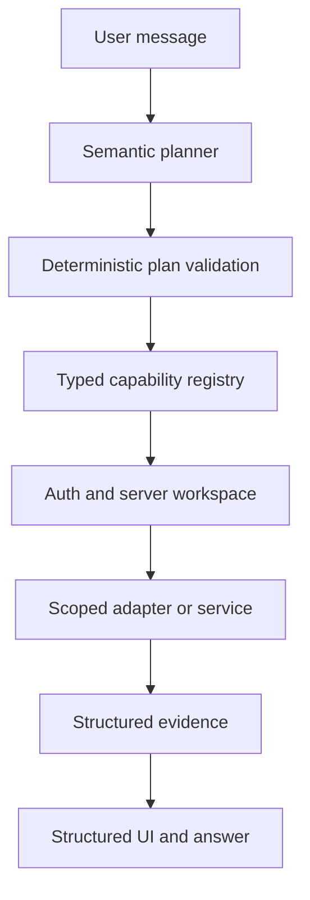

# Assistant architecture

Status: W3 foundation, independent of the pending W1 telecom data model.

## Runtime boundary

The model may propose a capability and arguments. It cannot choose a workspace, create SQL, select arbitrary URLs, grant permissions or manufacture a confirmation.

## Implemented foundation

- `CapabilityRegistry` rejects duplicate, open or internally inconsistent contracts. Contract v3 requires every handler to project its raw provider result into an explicit DTO before validation.
- `validatePlan` bounds the LLM plan to four registered goals, rejects tenant selectors and cycles, and permits at most one final write.
- `AssistantRuntime` validates closed inputs, permissions, tenant selectors, confirmations and idempotency before a handler runs.
- Workspace and actor are supplied only through server-created `ExecutionContext`.
- Server-issued opaque confirmations are bound to actor, workspace, capability, canonical arguments and a five-minute expiry; consume/cancel are one-time transitions.
- Writes reserve idempotency atomically before effects. Reservations carry a five-minute lease: a completion of unknown outcome remains pending during the lease and becomes `reconciliation_required` afterwards; it is never re-executed automatically. Replays return the stored structured result and changed arguments conflict.
- Capability outputs are projected at source, recursively validated against closed, bounded schemas and scanned for high-confidence secret values before presentation. Structural/key checks remain the primary boundary; value scanning is defense in depth.
- Unknown and unauthorized capabilities have one indistinguishable external denial; audit preserves the internal reason.
- Audit events contain identifiers and outcomes, not prompts, arguments, outputs, tokens or provider errors.
- `DurableConfirmationStore`, `DurableIdempotencyStore` and `DurableOutbox` define the production persistence boundary and explicit state machines. A reusable conformance harness tests atomic races, restart replay and post-effect uncertainty; the included in-memory adapter is reference evidence only.
- `AuthorizedReconciliationService` requires a server permission, server-resolved workspace, exact version and independently verified provider/read-after-write evidence before resolving uncertainty.
- `AssistantResponse` v1 gives W2 bounded entity, table, follow-up, confirmation, notice and navigation blocks without parsing Markdown.
- `OperationStatusEnvelope` v1 exposes only an opaque operation reference, public status and safe polling metadata; the browser cannot reconcile or force a terminal result.
- Streaming has a separate envelope; only the validated final event may carry structured interactive blocks.
- UI navigation and entity references require an injected closed taxonomy owned by W1.
- The 63-case eval catalog covers 45 semantic, failure and adversarial categories; `eval-metrics.ts` aggregates capability, argument, entity, grounding, action, hallucination, latency, token and cost measures. Telecom-dependent cases remain blocked until real readers/adapters exist.
- `telecom-catalog.ts` maps semantic read capabilities to exact W1 `telecom.v0` DTO references but deliberately registers no production handlers. Writes remain blocked on unpublished W1 write contracts.
- Model routing is provider-configurable and driven by bounded measurable signals such as context size, entity ambiguity, structured-output failures, goal count and grounded result volume. It does not use language regex as an intent engine.

## Supabase boundary

The core does not instantiate a Supabase client and does not claim RLS coverage. A future server adapter must:

1. authenticate the user;
2. resolve active workspace membership server-side;
3. construct `ExecutionContext` without accepting workspace identity from model or client arguments;
4. call only parameterized, workspace-scoped readers/writers;
5. rely on deny-by-default RLS as an additional boundary;
6. map database/provider failures to stable safe errors.

Authorization must never use user-editable metadata. Service-role credentials, if an adapter genuinely needs them, remain in a narrow server-only module and every resource ownership check is repeated there.

The lease/reconciliation state is a runtime contract, not a durable implementation claim. A production adapter must persist reservations and confirmations across processes and restart, and needs an operator/outbox reconciliation path that can mark the observed terminal result without repeating the effect.

## Capability publication checklist

Every production capability must declare:

- stable dotted name and description;
- closed input schema;
- bounded closed output schema;
- explicit provider-to-DTO output projector and high-confidence value scan policy;
- required permission;
- access class (`READ`, `SAFE_WRITE`, `SENSITIVE_WRITE`, `IRREVERSIBLE`);
- confirmation policy;
- idempotency policy;
- server tenant scope;
- safe error and audit behavior.

W1 owns telecom entity/field and service contracts. W3 has published a semantic catalog against stable `telecom.v0` presentation DTOs, but will not publish handlers until the accepted base exposes scoped readers. Catalog availability flags are authoritative; a mapped name is not an executable tool.

## Next increments

1. Obtain W4 review of the durable contract, conformance harness and reconciliation boundary.
2. Implement and register a durable adapter only on W4's accepted W1 integration base.
3. Bind catalog entries to W1 scoped readers and run live cross-tenant tests.
4. Benchmark configured model candidates with the 63-case eval set before choosing production routing.
5. Version n8n workflows only after the corresponding capability contract and W4 infrastructure handoff are stable.
