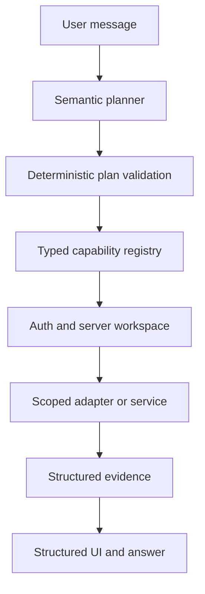

# Assistant architecture

Status: W3 foundation, independent of the pending W1 telecom data model.

## Runtime boundary

The model may propose a capability and arguments. It cannot choose a workspace, create SQL, select arbitrary URLs, grant permissions or manufacture a confirmation.

## Implemented foundation

- `CapabilityRegistry` rejects duplicate, open or internally inconsistent contracts. Contract v3 requires every handler to project its raw provider result into an explicit DTO before validation.
- `validatePlan` bounds the LLM plan to four registered goals, rejects tenant selectors and cycles, and permits at most one final write.
- `AssistantRuntime` validates closed inputs, permissions, tenant selectors, confirmations and idempotency before a handler runs.
- Workspace and actor are supplied only through server-created `ExecutionContext`.
- Server-issued opaque confirmations are bound to actor, workspace, capability, canonical arguments and a five-minute expiry; consume/cancel are one-time transitions.
- Writes reserve idempotency atomically before effects. Reservations carry a five-minute lease: a completion of unknown outcome remains pending during the lease and becomes `reconciliation_required` afterwards; it is never re-executed automatically. Replays return the stored structured result and changed arguments conflict.
- Capability outputs are projected at source, recursively validated against closed, bounded schemas and scanned for high-confidence secret values before presentation. Structural/key checks remain the primary boundary; value scanning is defense in depth.
- Unknown and unauthorized capabilities have one indistinguishable external denial; audit preserves the internal reason.
- Audit events contain identifiers and outcomes, not prompts, arguments, outputs, tokens or provider errors.
- `AssistantResponse` v1 gives W2 bounded entity, table, follow-up, confirmation, notice and navigation blocks without parsing Markdown.
- Streaming has a separate envelope; only the validated final event may carry structured interactive blocks.
- UI navigation and entity references require an injected closed taxonomy owned by W1.
- The eval catalog covers the required semantic and adversarial categories; `eval-metrics.ts` aggregates capability, argument, entity, grounding, action, hallucination, latency, token and cost measures. Telecom-dependent cases are explicitly blocked until W1 publishes contracts.

## Supabase boundary

The core does not instantiate a Supabase client and does not claim RLS coverage. A future server adapter must:

1. authenticate the user;
2. resolve active workspace membership server-side;
3. construct `ExecutionContext` without accepting workspace identity from model or client arguments;
4. call only parameterized, workspace-scoped readers/writers;
5. rely on deny-by-default RLS as an additional boundary;
6. map database/provider failures to stable safe errors.

Authorization must never use user-editable metadata. Service-role credentials, if an adapter genuinely needs them, remain in a narrow server-only module and every resource ownership check is repeated there.

The lease/reconciliation state is a runtime contract, not a durable implementation claim. A production adapter must persist reservations and confirmations across processes and restart, and needs an operator/outbox reconciliation path that can mark the observed terminal result without repeating the effect.

## Capability publication checklist

Every production capability must declare:

- stable dotted name and description;
- closed input schema;
- bounded closed output schema;
- explicit provider-to-DTO output projector and high-confidence value scan policy;
- required permission;
- access class (`READ`, `SAFE_WRITE`, `SENSITIVE_WRITE`, `IRREVERSIBLE`);
- confirmation policy;
- idempotency policy;
- server tenant scope;
- safe error and audit behavior.

W1 owns the telecom entity and field contracts. W3 will not publish telecom handlers until those contracts exist. Conceptual hints in the eval dataset are not production capability names.

## Next increments

1. Consume W1 status and map real telecom entities into adapters.
2. Add semantic planner model routing telemetry and provider adapters behind the validated plan boundary.
3. Implement durable confirmation and atomic idempotency stores against W1's published data/auth boundary.
4. Add cross-tenant integration tests against the W1 Supabase test project.
5. Version n8n workflows only after the corresponding capability contract is stable.
